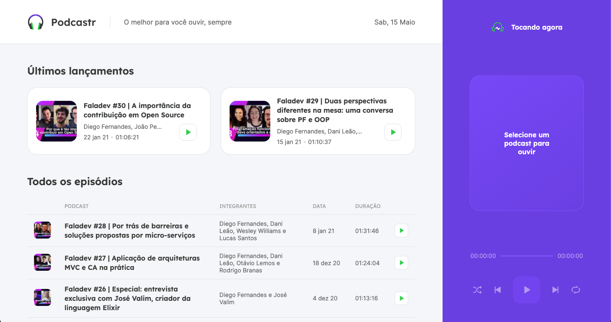
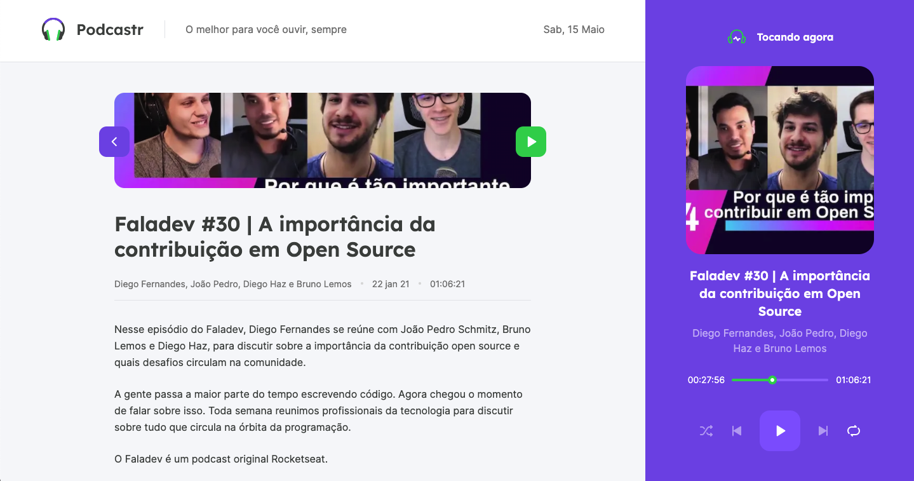

<!--  -->

<h1 style="font: 50px">Podcastr: Next Level Week 5 </h1>

<p>Projeto da 5ª Edição da NLW (Next Level Week), da RocketSeat.</p>

<p>Podcastr é uma plataforma de podcasts online.

<hr>

<p>NLW (Next Level Week) #5 project, by RocketSeat.</p>

<p>Podcastr in an online podcasts platform.</p>

<br>

<h1 style="font: 50px">Tecnologias / Technologies</h1>

<li>
    <a href="https://reactjs.org/">React JS</a>
</li>
<li>
    <a href="https://nextjs.org/">Next.js</a>
</li>
<li>
    <a href="https://sass-lang.com/">Sass</a>
</li>

<br>

<h1 style="font: 50px">Instalação e Execução / Installation and Execution</h1>

Clone o repositório em sua máquina e, em seguida execute o seguintes comando:

Clone the repository into your computer and then run the following script:

```
yarn

# ou / or

npm install
```

Após isso, execute o comando à seguir:

After that, run the following script:

```
yarn serve

# ou / or

npm run serve
```

Em um novo terminal, execute o comando:

In a new terminal, run the script:

```
yarn dev

# ou / or

npm run dev
```


<br>

<h1 style="font: 50px">Preview</h1>

<p>Website: <a href=""></a></p>

<p>Home (Player off):</p>


<p style="margin-top: 30px;">Episode (Player on):</p>


<h1 style="font: 50px; margin-top: 20px;">Licença / License</h1>

<a href="https://opensource.org/licenses/MIT">MIT License</a>
